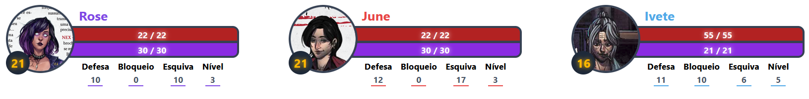
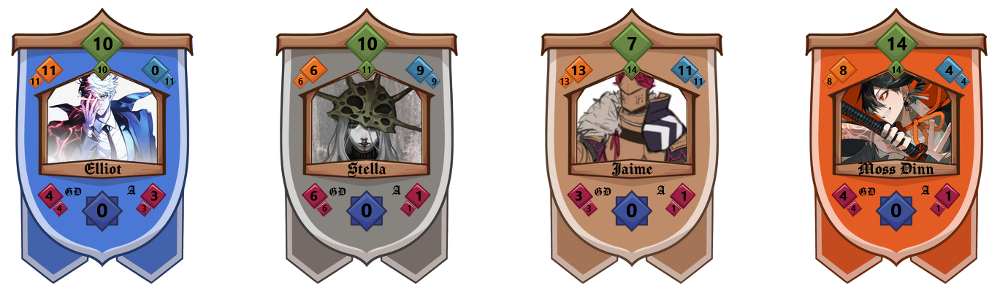

# 🎲 RPG Overlay para OBS

Uma ferramenta simples para exibir fichas de personagens de **RPGs de mesa** diretamente no **OBS Studio** como **source de navegador**.

## Funcionalidades

- Criação e edição de fichas de personagens pela dashboard:


- Visual personalizável por sistema (cores, foto do personagem, atributos):


- Opção de Overlay da campanha inteira ou personagem individual ( Para todos os sistemas, até customizados)


- Layouts personalizados para sistemas ( Atualmente: Ordem Paranormal e Mythic Bastionland):




- Possibilidade de adicionar **sistemas customizados**

## Sistemas Suportados

- Ordem Paranormal (com e sem Determinação)
- Tormenta
- Dungeons & Dragons
- Call of Cthulhu
- Mythic Bastionland
- Daggerheart
- Blades in the Dark
- Cyberpunk RED
- Customizado (qualquer outro sistema pelo `systems.json`)

## Como rodar o projeto

### 1. Clone ou baixe o repositório

```bash
git clone https://github.com/Chrb09/ttrpg-obs-overlay.git
cd ttrpg-obs-overlay
```

Ou baixe o ZIP diretamente pelo GitHub.

### 2. Instale as dependências

Certifique-se de ter **Node.js** e **npm** instalados.

```bash
npm i
```

### 3. Inicie o servidor

```bash
npm run dev
```

### 4. Acesse a Dashboard

Abra no navegador:
[http://localhost:3000/dashboard](http://localhost:3000/dashboard)

Aqui você poderá criar e editar personagens/campanhas.

### 5. Adicione ao OBS

- Clique no botão **Copiar Link** (da campanha ou do personagem).
- No OBS: **Adicionar Fonte → Browser**
- Cole o link, ajuste largura/altura e posicione como quiser.

## Criando Sistemas Personalizados

Você pode adicionar seus próprios sistemas no arquivo `systems.json` na root do projeto.

### Exemplo:

```json
"Nome do Sistema": {
  "bg_from_color": "#123456",
  "bg_to_color": "#654321",
  "image_name": "nomeImagem.png",
  "stats": [
    { "name": "Stat com barra", "value": 1, "max": 10, "color": "#FF0000" },
    { "name": "Stat sem barra", "value": 5 },
    { "name": "Stat String", "value": "Texto Qualquer" },
    { "name": "Stat Boolean", "value": false }
  ]
}
```

### Tipos de atributos suportados:

- **Barra** → { "name": "Vida", "value": 10, "max": 20, "color": "#B22222" }
- **Número simples** → { "name": "Nível", "value": 5 }
- **Texto** → { "name": "Classe", "value": "Mago" }
- **Booleano** → { "name": "Fatigado", "value": false }
